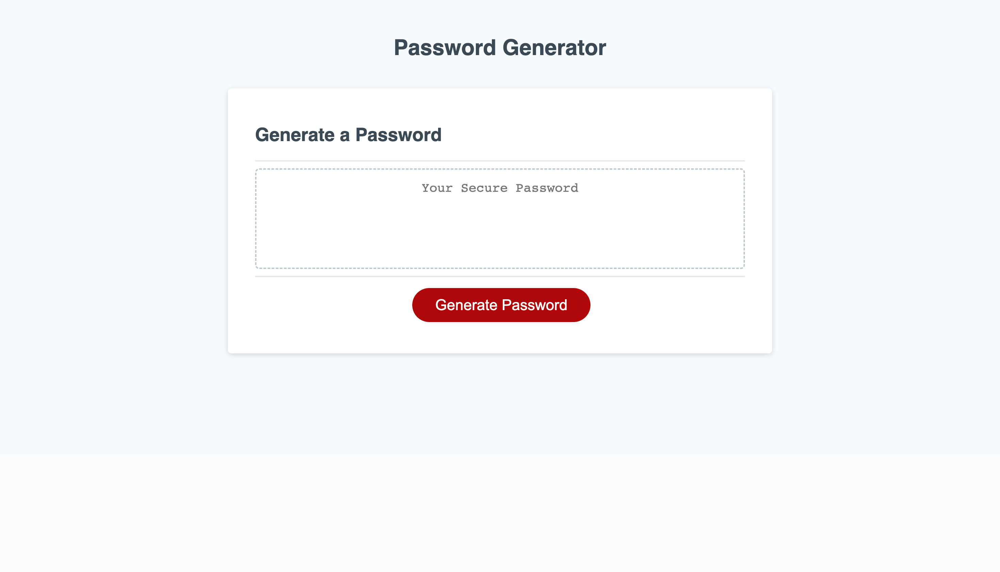

# password-challenge-3-repo

## A random password generator

## Description 
Allows users to generate a random password based on criteria that users enter. Password can include special characters, uppercase letters, lowercase letters, and numbers. Provides random password for length that users input.

## Visuals
 

## Technologies
* html
* css
* javascript

## Installation
N/A

## Usage
To use this webpage, click the generate password button. A series of prompts will then run for the user to input information on password criteria including length of password and the use of special characters. A random password will then be generated based on users input, and will be placed in the "Your Secure Password" box.

## Credits
Received starter code from the following repository. https://github.com/coding-boot-camp/friendly-parakeet
Thanks to Cody Junier and Michael Bell for their contributions and guidance.

## License
MIT